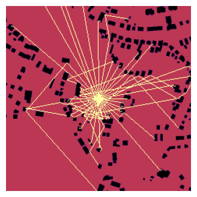

# **I**mage-**P**hysics-**S**imulation

This is a library for 2D Ray-Tracing on an image. For example the Physgen Dataset, [see here](https://huggingface.co/datasets/mspitzna/physicsgen).

Contents:
- [Installation](#installation)
- [Download Example Data](#download-example-data)
- [Library Overview](#library-overview)
- [Raytracing Computation](#raytracing-computation)
- [Raytracing Tutorial](#raytracing-tutorial)
- [Performance Test](#performance-test)

[> Documentation <](https://xxai-botxx.github.io/Image-Physics-Simulation/img_phy_sim.html)

</img>

<br><br>

### Installation

This repo only need some basic libraries:
- `numpy` 
- `matplotlib` 
- `opencv-python`
- `scikit-image`

You can download / clone this repo and run the example notebook via following Python/Anaconda setup:
```bash
conda create -n img-phy-sim python=3.13 pip -y
conda activate img-phy-sim
pip install numpy matplotlib opencv-python ipython jupyter shapely prime_printer datasets==3.6.0 scikit-image
pip install torch torchvision torchaudio --index-url https://download.pytorch.org/whl/cu126
```

You can also use this repo via [Python Package Index (PyPI)](https://pypi.org/) as a package: 
```bash
pip install img-phy-sim
```

Here the instructions to use the package version of `ips` and an anconda setup:
```bash
conda create -n img-phy-sim python=3.13 pip -y
conda activate img-phy-sim
pip install img-phy-sim
```

To run the example code you still need:
```bash
pip install prime_printer shapely datasets==3.6.0
pip install torch torchvision torchaudio --index-url https://download.pytorch.org/whl/cu126
```

<br><br>

### Download Example Data

You can download Physgen data if wanted via the `physgen_dataset.py` using following commands:

```bash
conda activate img-phy-sim
cd "D:\Informatik\Projekte\Image-Physics-Simulation" && D:
python physgen_dataset.py --output_real_path ./datasets/physgen_train_raw/real --output_osm_path ./datasets/physgen_train_raw/osm --variation sound_reflection --input_type osm --output_type standard --data_mode train
```

```bash
python physgen_dataset.py --output_real_path ./datasets/physgen_test_raw/real --output_osm_path ./datasets/physgen_test_raw/osm --variation sound_reflection --input_type osm --output_type standard --data_mode test
```

```bash
python physgen_dataset.py --output_real_path ./datasets/physgen_val_raw/real --output_osm_path ./datasets/physgen_val_raw/osm --variation sound_reflection --input_type osm --output_type standard --data_mode validation
```

<br><br>

### Library Overview

- Img-Phy-Sim (ips)
    - `ray_tracing`
        - `get_wall_map`: extracting a wall-map from an image
        - `trace-beam`: calculates one ray
        - `trace_beams`: load an image, extract the wall-map and trace multiple beams
        - `draw_rays`: draw/export the rays as/inside an image
        - `print_rays_info`: get some interesting informations about your rays
        - `save`: save your rays as txt file
        - `open`: load your saved rays txt file
        - `get_linear_degree_range`: get a range for your beam-directions -> example beams between 0-360 with stepsize 10
        - `merge_rays`: merge 2 rays to one 'object'
    - `img`
        - `open`: load an image via Open-CV
        - `save`: save an image
        - `imshow`: show an single image (without much features)
        - `advanced_imshow`: show multiple images with many options
        - `show_image_with_line_and_profile`: show an image with a red line + the values of the image on this line
        - `plot_image_with_values`: plot an image with it's value plotted and averaged to see your image in values


That are not all functions but the ones which should be most useful. Check out the documentation for all functions.

<br><br>

### Raytracing Computation

1. A map is created which contains the vector of all "walls" (collision objects) in the image as a single degree value. This is done using the `ips.ray_tracing.get_wall_map`-function, which internally uses the canny-edge detection algorithm from OpenCV. The whole process is masked to get the edges for the given wall-values. In order to put the degree/direction values into the wall-map, we following the `Bresenham's line algorithm` to go from one point pixel-wise to the end-point of the edge and on the way we put the value of thes epixels and the pixels around, depending of the used *thickness*. 
2. The `ips.ray_tracing.trace_beam`-function goes from pixel to pixel and checks if the pixel-value is a "wall" (collision-object). If yes, a new beam is added using the wall-map to calculate the right direction-vector. To know, which pixel is the next pixel, we use the average vector between the direction vector (the target direction which is available since the beginning of a beam calculation) and a vector pointing to the closest point of the optimal way/vector. Why so complicated? Because we move per pixel and pixel does only know 8 directions, but we want to move more smooth in more directions. The direction vector from the beginning is helpful but will lead every update to the same pixel, because it does not use the information of the current position. THis is bad because so we will move very wrong if going only after the goal vector with our limited step-directions. And so we add the described "to the perfect line"-vector into the calculation weighted a bit less then the real direction (0.5).<br>The "perfect line" is calculated very easy. At the beginning of a beam we move in small steps (like 0.01) forward towards the target direction, ignoring pixel-wise approach, until we hit with x or y a boundary of the image.

> You may have noticed that we use a own and Bresenham's line algorithm for moving in the pixel-space, which have no further reason and we may only use one of them in future.


<br><br>

### Raytracing Tutorial

[See also the example notebook 👀](./example/physgen.ipynb)

In general you need to do:
1. **Load your Image** -> using `ips.img.open`
2. **Calculate the Wall-Map** -> using `ips.ray_tracing.get_wall_map`
3. **Calculate the Beams** -> using `ips.img.open`
4. **Draw (Export) the Beams** -> using `ips.img.open`

Using this lib, this is reduced to:
1. **Calculate the Beams** (including Wall-Map and loading your Image) -> using `ips.img.open`
2. **Draw (Export) the Beams** -> using `ips.img.open`

See this example:

```python
rays = ips.ray_tracing.trace_beams(rel_position=[0.5, 0.5], 
                                   img_src=img_src, 
                                   directions_in_degree=ips.ray_tracing.get_linear_degree_range(step_size=10),
                                   wall_values=None, 
                                   wall_thickness=1,
                                   img_border_also_collide=False,
                                   reflexion_order=1,
                                   should_scale_rays=True,
                                   should_scale_img=True)
ips.ray_tracing.print_rays_info(rays)

ray_img = ips.ray_tracing.draw_rays(rays, detail_draw=False, 
                                    output_format="single_image", 
                                    img_background=img, ray_value=2, ray_thickness=1, 
                                    img_shape=(256, 256), dtype=float, standard_value=0,
                                    should_scale_rays_to_image=True, original_max_width=None, original_max_height=None)
ips.img.imshow(ray_img, size=5)
```

**Rays structure:**<br>
The Raytracing result is a list of rays, where every ray can consist of multiple beams which comes from reflections. One beam is a list of multiple points, where the first point is the start point and the last element is the end point.

Example:
```text
[
    [[start-point, ..., end-point], [start-point, ..., end-point]],  # one reflection
    [[start-point, ..., end-point]],  # no reflection
    # ...
]
```

<br><br>

Now let's go step by step how to apply ray-tracing to your image.

<br><br>

**1. Analyzing your image**<br>
First it is important you know the values of your image and which values should consider an object for collision. For that use the tools given with this package:
```python
img = ips.img.open(src=img_src, should_scale=False, should_print=True)
ips.img.imshow(img, size=4, axis_off=False)
ips.img.show_image_with_line_and_profile(imgs=[img], axis='row', index=None, titles=None, figsize=(10, 8));
```
If you see super small values then you might tried to scale your already scaled image. 

<br><br>

**2. Get the Collision Ready**<br>
Next it is helpful to check if your collision is ready by running the wall-map by yourself (later you will use the wrapper, but here you can find the right params).

```python
wall_map = ips.ray_tracing.get_wall_map(img, wall_values=None, thickness=0)
ips.img.imshow(wall_map, size=4, axis_off=False)
ips.img.show_image_with_line_and_profile(imgs=[wall_map], axis='row', index=None, titles=None, figsize=(10, 8));
```

You can give `wall_values` a list of values, which you want to collide with. 

<br><br>

**3. Let's start tracing the rays!**<br>
Now everything should be ready for tracing the rays. The following code include loading your image and creating the wall-map.

```python
rays = ips.ray_tracing.trace_beams(rel_position=[0.5, 0.5], 
                                   img_src="./my_image.png", 
                                   directions_in_degree=ips.ray_tracing.get_linear_degree_range(start=0, stop=360, step_size=10),
                                   wall_values=[0.0], 
                                   wall_thickness=0,
                                   img_border_also_collide=False,
                                   reflexion_order=1,
                                   should_scale_rays=True,
                                   should_scale_img=True)
ips.ray_tracing.print_rays_info(rays)
```

Following features are included:
- Setting custom startposition for raytracing
- Adding custom beam shooting positions in degree (where 0° is the east/right of the image and 90° is south/bottom and so on)
- Setting reflexion order (how many maxium reflexions should be calculated)
- Setting if the border of the image should be reflective or not
- And setting if the input image should be scaled and if the rays itself should be scaled
- You can also set the "wall" object values, which should get detected as objects with collision. If set to None, the programm will find all clear edges.
- Setting if the rays should be in 0.0-1.0 range or the real image range
- Whether to scale the image or not

<br><br>

**4. Export your rays**<br>
At the end you might want to use your rays in an image. We provide you with a draw/export function with many flexibility.

Features are:
- Custom value of ray-traces
- Thickness of ray-traces
- Drawing on empty image or an existing image
    - Given image-shape, dtype and fill-value (standard-value)
- Scaling rays to the given image
- Different Format Types
    - One Image -> `single_image`
    - Multiple Images (each ray on one image) -> `multiple_images`
    - One Image and each channel is one ray -> `channels`
- Showing only the reflexions
- Give different values for different reflexion orders
```
ray_img = ips.ray_tracing.draw_rays(rays, detail_draw=False, 
                                    output_format="single_image", 
                                    img_background=None, ray_value=2, ray_thickness=1, 
                                    img_shape=(256, 256), dtype=float, standard_value=0,
                                    should_scale_rays_to_image=False, original_max_width=None, original_max_height=None,
                                    show_only_reflections=False)
ips.img.imshow(ray_img, size=4)
```

<br><br>

I hope this little tutorial could be helpful. Good luck with your project <3

<br><br>

### Performance Test

<br>

[> See the notebook/code <](./example/physgen_performance.ipynb)

Executed with 50 random images.

Standard Settings were:
- test_amount=50
- step_size=10
- reflexion_order=3
- ray_scaling=True
- detail_draw=False
- output_format="channels"

<br>

Investigated Factors:
- `Ray Amount` (step_size)
- `Scaling of Rays` (ray_scaling)
- `Reflexion Order` (reflexion_order)
- `Detail Drawing of Rays` (detail_draw)


<br><br>

Experiment 1: Ray Amount

```text
Number of experiments: 4

            avg_time            : mean=16.0064, std=23.6257, min=0.5744, max=56.7918, rel_change=351.22%
            median_time         : mean=15.4329, std=22.7908, min=0.5546, max=54.7799, rel_change=351.36%
            var_time            : mean=17.1176, std=29.2774, min=0.0076, max=67.8259, rel_change=396.19%
            avg_compute_time    : mean=15.1070, std=22.2322, min=0.5529, max=53.4815, rel_change=350.36%
            median_compute_time : mean=14.5613, std=21.4404, min=0.5346, max=51.5723, rel_change=350.50%
            var_compute_time    : mean=14.7739, std=25.2362, min=0.0074, max=58.4825, rel_change=395.80%
            avg_draw_time       : mean=0.8994, std=1.3940, min=0.0215, max=3.3103, rel_change=365.67%
            median_draw_time    : mean=0.8373, std=1.2914, min=0.0207, max=3.0705, rel_change=364.22%
            var_draw_time       : mean=0.1525, std=0.2639, min=0.0000, max=0.6096, rel_change=399.67%

Overall trend in avg_time: increasing (1.7306e+01 change per experiment)
Conclusion: Performance changes significantly across experiments.
```


<br><br>

Experiment 2: Ray Scaling

```text
Number of experiments: 2

            avg_time            : mean=0.5744, std=0.0078, min=0.5666, max=0.5823, rel_change=2.73%
            median_time         : mean=0.5558, std=0.0080, min=0.5478, max=0.5637, rel_change=2.86%
            var_time            : mean=0.0078, std=0.0000, min=0.0078, max=0.0078, rel_change=0.16%
            avg_compute_time    : mean=0.5581, std=0.0024, min=0.5557, max=0.5605, rel_change=0.86%
            median_compute_time : mean=0.5398, std=0.0026, min=0.5372, max=0.5423, rel_change=0.95%
            var_compute_time    : mean=0.0075, std=0.0000, min=0.0075, max=0.0075, rel_change=0.13%
            avg_draw_time       : mean=0.0163, std=0.0055, min=0.0108, max=0.0218, rel_change=66.90%
            median_draw_time    : mean=0.0160, std=0.0053, min=0.0106, max=0.0213, rel_change=66.86%
            var_draw_time       : mean=0.0000, std=0.0000, min=0.0000, max=0.0000, rel_change=67.83%

Overall trend in avg_time: decreasing (-1.5690e-02 change per experiment)
Conclusion: Performance changes slightly across experiments.
```

<br><br>

Experiment 3: Reflexion Order

```text
Number of experiments: 6

            avg_time            : mean=0.9300, std=0.7354, min=0.3231, max=2.4409, rel_change=227.71%
            median_time         : mean=0.8502, std=0.6128, min=0.3253, max=2.0917, rel_change=207.76%
            var_time            : mean=0.4635, std=0.9329, min=0.0002, max=2.5421, rel_change=548.45%
            avg_compute_time    : mean=0.9014, std=0.7194, min=0.3088, max=2.3798, rel_change=229.74%
            median_compute_time : mean=0.8241, std=0.6002, min=0.3108, max=2.0401, rel_change=209.83%
            var_compute_time    : mean=0.4449, std=0.8953, min=0.0002, max=2.4396, rel_change=548.32%
            avg_draw_time       : mean=0.0286, std=0.0160, min=0.0143, max=0.0611, rel_change=163.74%
            median_draw_time    : mean=0.0266, std=0.0129, min=0.0144, max=0.0521, rel_change=142.21%
            var_draw_time       : mean=0.0002, std=0.0004, min=0.0000, max=0.0011, rel_change=550.06%

Overall trend in avg_time: increasing (3.7365e-01 change per experiment)
Conclusion: Performance changes significantly across experiments.
```

<br><br>

Experiment 4: Detail Draw

```text
Number of experiments: 2

            avg_time            : mean=0.6282, std=0.0515, min=0.5767, max=0.6796, rel_change=16.39%
            median_time         : mean=0.6101, std=0.0507, min=0.5593, max=0.6608, rel_change=16.63%
            var_time            : mean=0.0115, std=0.0040, min=0.0074, max=0.0155, rel_change=70.54%
            avg_compute_time    : mean=0.5572, std=0.0020, min=0.5552, max=0.5592, rel_change=0.70%
            median_compute_time : mean=0.5430, std=0.0047, min=0.5383, max=0.5478, rel_change=1.75%
            var_compute_time    : mean=0.0074, std=0.0002, min=0.0072, max=0.0076, rel_change=5.32%
            avg_draw_time       : mean=0.0709, std=0.0495, min=0.0214, max=0.1204, rel_change=139.55%
            median_draw_time    : mean=0.0663, std=0.0454, min=0.0209, max=0.1117, rel_change=137.05%
            var_draw_time       : mean=0.0011, std=0.0011, min=0.0000, max=0.0022, rel_change=199.31%

Overall trend in avg_time: increasing (1.0292e-01 change per experiment)
Conclusion: Performance changes slightly across experiments.
```

<br><br>

Summary:

The Stepsize/amount of rays have the biggest impact on the performance. The other parameters have rather a small impact.


| **Experiment** | **Number of Experiments** | **avg_time (mean ± std)** | **avg_compute_time (mean ± std)** | **avg_draw_time (mean ± std)** | **rel_change (avg_time)** | **Trend**                 | **Conclusion** |
| --- | --- | --- | --- | --- | --- | --- | --- |
| **1. Ray Amount** | 4 | 16.01 ± 23.63 s | 15.11 ± 22.23 s | 0.90 ± 1.39 s | **351.22 %** | Increasing (+17.31 s/exp) | Performance changes **significantly** |
| **2. Ray Scaling** | 2 | 0.57 ± 0.01 s | 0.56 ± 0.00 s | 0.016 ± 0.006 s | **2.73 %** | Decreasing (−0.016 s/exp) | Performance changes **slightly** |
| **3. Reflection Order** | 6 | 0.93 ± 0.74 s | 0.90 ± 0.72 s | 0.029 ± 0.016 s | **227.71 %** | Increasing (+0.37 s/exp) | Performance changes **significantly** |
| **4. Detail Draw** | 2 | 0.63 ± 0.05 s | 0.56 ± 0.00 s | 0.071 ± 0.050 s | **16.39 %**  | Increasing (+0.10 s/exp)  | Performance changes **slightly** |


